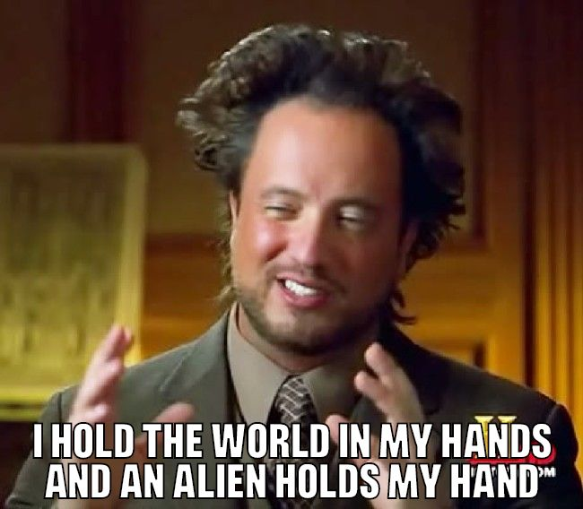

# readme
v0.0.2 | Public Domain

A basic console program to add text to images and make memes.

This is the new cross platform version of mememaker for .Net Core 3. Is it cross platform? I don't know. Anyway it uses .Net Core 3 and 
they say it is cross platform.

This version uses the Skia library for more control over the text. The graphics library inside .Net Core 3 
is inadequate.

# overview
This is how you use it:

Note: Currently you can't change the text size. It is fixed to 48pt.

```
memetext ancient-aliens.jpg "" "i hold the world in my hands and an alien holds my hand"
```

Now you can use the internal image the program files like this:
```
memetext /res:ancient-aliens "" "i hold the world in my hands and an alien holds my hand"
```

Gives you this<br>


# credits
**pressuru.otf** is from the [memetastic project](https://github.com/gsantner/memetastic).