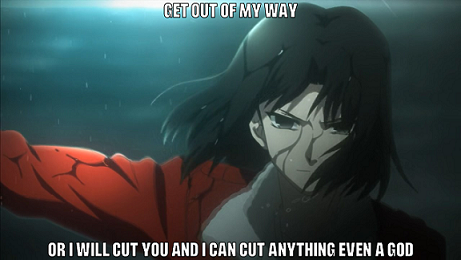
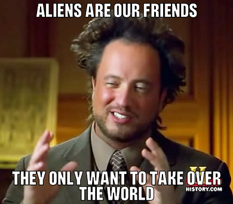

# readme
v0.0.2 | Public Domain

A basic console program to add text to images and make memes.

This is the new cross platform version of mememaker for .Net Core 3. Is it cross platform? I don't know. Anyway it uses .Net Core 3 and 
they say it is cross platform.

This version uses the Skia library for more control over the text. The graphics library inside .Net Core 3 
is inadequate.

# build
Install the .Net Core 3 SDK.

To produce the binary files go to the project files and type:

```
dotnet publish -c Release
```

# overview
This is how you use it:

Note: Currently you can't change the text size. It is fixed to 48pt.

```
memetext cut-you.jpg "get out of my way" "or i will cut you and i can cut anything even a god"
```


I use this file a lot so I put it in the resource section.
```
memetext /res:ancient-aliens "aliens are our friends" "they only want to take over the world"
```


# credits
**pressuru.otf** is from the [memetastic project](https://github.com/gsantner/memetastic).